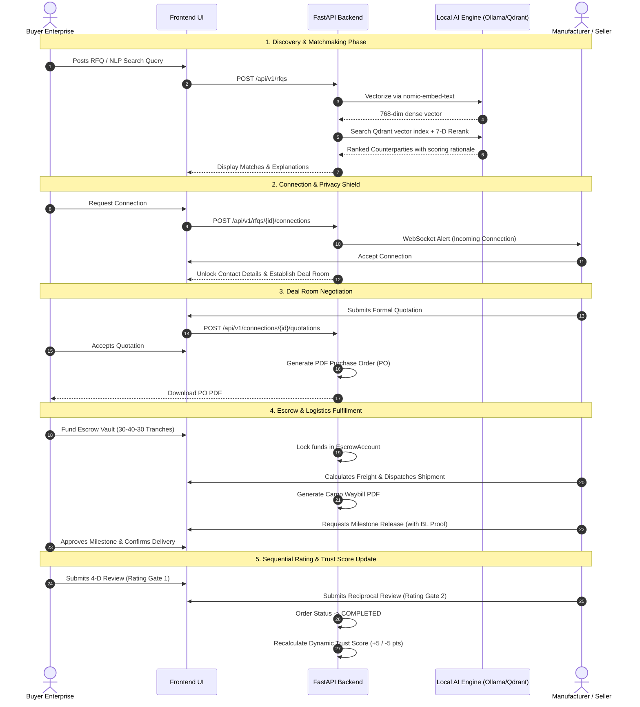

# Enterprise B2B Marketplace Platform — Complete Demo & Architecture Guide

> **Confidential & Proprietary** — Client Demonstration, Functional Walkthrough & Technical Architecture Manual.  
> **Platform Version:** 2.4.0 (Production Release)  
> **Target Audience:** Enterprise Clients, Procurement Heads, CTOs, Commercial Directors, and Solutions Architects.

---

## Table of Contents
1. [Executive Summary & Platform Value Proposition](#1-executive-summary--platform-value-proposition)
2. [Quick-Start Demo Credentials & Setup](#2-quick-start-demo-credentials--setup)
3. [Recommended 15-Minute Client Demo Script (The Golden Path)](#3-recommended-15-minute-client-demo-script-the-golden-path)
4. [End-to-End Deal Lifecycle Diagram](#4-end-to-end-deal-lifecycle-diagram)
5. [Comprehensive Feature Breakdown (Frontend UX & Backend Engine)](#5-comprehensive-feature-breakdown-frontend-ux--backend-engine)
   - [5.1 Authentication, Roles & Privacy Shield](#51-authentication-roles--privacy-shield)
   - [5.2 Corporate Profile, Anti-Fraud Engine & Dynamic Trust Scoring (0–100)](#52-corporate-profile-anti-fraud-engine--dynamic-trust-scoring-0100)
   - [5.3 Enterprise Compliance & Digital Certificate Vault](#53-enterprise-compliance--digital-certificate-vault)
   - [5.4 Multi-Sided RFQ Authoring & Specification Management](#54-multi-sided-rfq-authoring--specification-management)
   - [5.5 Two-Stage Hybrid Matchmaking Engine (7-D Scoring & Vector Retrieval)](#55-two-stage-hybrid-matchmaking-engine-7-d-scoring--vector-retrieval)
   - [5.6 Sourcing Catalog & Faceted Exploration (10,000+ Listings)](#56-sourcing-catalog--faceted-exploration-10000-listings)
   - [5.7 Sub-Millisecond Natural Language Query Extractor](#57-sub-millisecond-natural-language-query-extractor)
   - [5.8 Multi-Agent Conversational AI Business Copilot (6 Personas & Tool Calling)](#58-multi-agent-conversational-ai-business-copilot-6-personas--tool-calling)
   - [5.9 Consent-Gated Connections & The Private Deal Room](#59-consent-gated-connections--the-private-deal-room)
   - [5.10 Real-Time Multilingual Communication (11 Languages & WebSocket Sync)](#510-real-time-multilingual-communication-11-languages--websocket-sync)
   - [5.11 Multimodal Vision AI Content Moderation & Webcam KYC](#511-multimodal-vision-ai-content-moderation--webcam-kyc)
   - [5.12 Commercial Quotations & Dynamic Contract Negotiation](#512-commercial-quotations--dynamic-contract-negotiation)
   - [5.13 Automated Vector PDF Generation (PO, Commercial Invoice, Waybill)](#513-automated-vector-pdf-generation-po-commercial-invoice-waybill)
   - [5.14 3-Tranche Milestone Escrow Vault & Dispute Arbitration](#514-3-tranche-milestone-escrow-vault--dispute-arbitration)
   - [5.15 Multi-Modal Freight Logistics & Incoterms 2020 Landed Cost Engine](#515-multi-modal-freight-logistics--incoterms-2020-landed-cost-engine)
   - [5.16 Sequential 4-Dimensional Mutual Rating Protocol](#516-sequential-4-dimensional-mutual-rating-protocol)
   - [5.17 Executive Analytics Dashboard & Notification System](#517-executive-analytics-dashboard--notification-system)
6. [System Technology Stack & Infrastructure Architecture](#6-system-technology-stack--infrastructure-architecture)
7. [Client FAQ & High-Value Pitch Talking Points](#7-client-faq--high-value-pitch-talking-points)

---

## 1. Executive Summary & Platform Value Proposition

This platform is a **next-generation, AI-assisted B2B trade and procurement ecosystem** engineered to solve the four traditional failure points of global wholesale commerce:
1. **Cold Discovery Failure**: High search friction for industrial specifications (grades, tolerances, packaging, certifications).
2. **Counterparty Fraud & Low Trust**: Anonymous brokers, fake tax filings, duplicate registrations, and unverified credentials.
3. **Cross-Border Negotiation Friction**: Currency conversions, language barriers, complex Incoterms 2020 rules, and volatile freight logistics.
4. **Counterparty Payment & Delivery Risk**: Upfront wire vulnerability for buyers vs. payment default risk for manufacturers.

### Core Architectural Pillars
- **Zero-PII Public Surface (Privacy Shield)**: Contact details, phone numbers, and direct emails remain completely hidden until both parties mutually accept a connection request.
- **Explainable 7-Dimensional Matchmaking**: Matches dense vector semantic embeddings (Qdrant) with deterministic business constraints (price, volume, units, distance, specs, deadlines) with complete transparency into why every score was awarded.
- **Local-First, Privacy-Preserving AI**: Runs local high-performance open-weight models (Ollama runtime) for multi-agent negotiation assistance, live translation, and vision moderation, guaranteeing zero trade secrets or proprietary RFQ data leak to third-party cloud APIs.
- **Complete End-to-End Deal Room**: Everything from live translated chat, formal quotation creation, vector PDF contracts (PO/Invoice/Waybill), 3-tranche milestone escrow, multi-modal freight calculation, and double-blind reviews happens inside a single screen.

---

## 2. Quick-Start Demo Credentials & Setup

To conduct an uninterrupted, high-impact demonstration, open two separate browser windows (one standard window for the **Buyer**, one private/incognito window for the **Seller**).

### Ready-to-Use Seed Accounts (All pre-populated with realistic trade data)
* **Master Password for all test accounts:** `trade2026demo`

| Role | Account Email | Company Profile & Focus | Initial Trust Score |
| :--- | :--- | :--- | :---: |
| **Buyer Persona** | `buyer1@marketplace.dev` | Apex Industrial Procurement (Mumbai, India) | 85 / 100 (Verified) |
| **Seller Persona** | `seller1@marketplace.dev` | Global Pack Solutions Ltd (Surat, India) | 95 / 100 (Verified + ISO) |
| **Dual Persona** | `demo@marketplace.dev` *(Password: `demo password 123`)* | TransWorld Trading Corp (Registered as Buyer & Seller) | 75 / 100 |

### Local Service Ports Reference
- **Frontend Web UI:** `http://localhost:5173` (Vite + React 18)
- **Backend API Gateway:** `http://localhost:8011` (FastAPI + Async SQLAlchemy)
- **Interactive API Docs (Swagger):** `http://localhost:8011/docs`
- **Vector Database (Qdrant):** `http://localhost:6333/dashboard`
- **PostgreSQL Database:** `localhost:5433` (`project_db`)
- **Local AI Inference (Ollama):** `http://localhost:11434` (`qwen3-coder-next`, `nomic-embed-text`, `qwen3-vl:8b`)

---

## 3. Recommended 15-Minute Client Demo Script (The Golden Path)

Follow this structured chronological narrative during your client presentation to showcase maximum business value:

```
[Step 1: Marketplace & NLP Search] ──> [Step 2: AI Multi-Agent Copilot] ──> [Step 3: 7-D Matchmaking]
                                                                                      │
                                                                                      ▼
[Step 6: Mutual Review & Trust]   <── [Step 5: Escrow, Freight & Docs] <── [Step 4: Deal Room & Chat]
```

### Phase 1: Discovery & NLP Intelligence (3 Minutes)
1. **Login as Buyer** (`buyer1@marketplace.dev`).
2. Navigate to **Marketplace** (`/marketplace`).
3. **Showcase NLP Search**: Type a conversational prompt into the search bar:  
   `"Need 500 units of 5-ply corrugated carton boxes in Mumbai under ₹45/box"`.
4. **Highlight**: Point out how the sub-millisecond regex parser immediately extracts:
   - Product: *Corrugated carton boxes*
   - Quantity: *500 units*
   - Location: *Mumbai*
   - Target Price: *₹45 / box*
5. Demonstrate **Faceted Filters**: Toggle `"Verified Suppliers Only"`, filter by category, and show the **Privacy Shield** (seller email/phone are protected).

### Phase 2: Autonomous AI Business Copilot (3 Minutes)
1. Navigate to **AI Assistant** (`/ai-chat`).
2. Show the **6 Specialized Personas** (Market Research, RFQ Drafting, Negotiation Coach, Price Analyst, Logistics Advisor, Supplier Verification).
3. Select the **RFQ Drafting Agent** and type:  
   `"I need to source 10,000 units of food-grade kraft paper bags with handles"`.
4. **Highlight**: Watch the streaming AI interactively prompt for missing technical parameters (GSM, handle type, dimensions, delivery date).
5. Watch the **Tool Calling Execution Step**: The agent calls `update_rfq_draft` and `create_rfq` directly in the database.
6. Open the **In-Chat Match Cart Drawer**: The AI instantly queries Qdrant and displays the top 3 compatible manufacturers with compatibility percentages.
7. Click **Connect** on the top manufacturer right from inside the chat.

### Phase 3: The 7-Dimensional Matchmaking Engine (3 Minutes)
1. Navigate to **My RFQs** (`/rfqs`) and click **Find Matches** on an active listing.
2. Show the client the **Scoring Transparency Card**:
   - Total Compatibility Score (e.g., `92%`).
   - The 7 Dimension Breakdown: **Semantic Relevance** (28%), **Attributes & Specs** (22%), **Price Direction** (16%), **Quantity Capacity** (12%), **Category Overlap** (10%), **Location & Proximity** (8%), **Delivery Deadline** (4%).
   - Explain the **Guardrails**: A candidate with 100% price or location match *cannot* rank if the product identity is irrelevant.

### Phase 4: Deal Room Negotiation & Multilingual Translation (3 Minutes)
1. Switch to the incognito window, login as **Seller** (`seller1@marketplace.dev`), and open **Messages** (`/messages`).
2. Accept the incoming connection request from Apex Industrial. Show how contact details unlock.
3. Open the **WebSocket Live Chat**:
   - Send a message in **Spanish** or **Hindi**: `"Podemos despachar las cajas corrugadas en 10 días."`
   - Switch to the Buyer screen: Show the message auto-translated to **English** in real-time with an original translation badge.
4. Open the **Webcam KYC Snapshot**:
   - Demonstrate the **Multimodal Vision AI Moderator** (`qwen3-vl:8b`): Capture a live frame; highlight the real-time AI safety verification badge.

### Phase 5: Commercial Closing, Escrow & Multi-Modal Freight (3 Minutes)
1. On the Seller screen, open the right sidebar **Quotes & Negotiation Tab**:
   - Issue a formal Quotation: Unit Price: `₹42.00`, Quantity: `500`, Incoterm: `FOB`, Tax: `18% GST`.
2. On the Buyer screen:
   - Click **Accept Quotation**.
   - Download the instant, print-ready vector **Purchase Order (PO) PDF** generated on the fly.
3. Switch to the **Escrow Vault & Milestones Tab**:
   - Show the automated 3-tranche vault (30% Advance, 40% Dispatch, 30% Delivery Acceptance).
   - Buyer clicks **Fund Escrow Vault** (Funds lock into smart escrow).
4. Switch to the **Logistics & Multi-Modal Freight Tab**:
   - Show the automated lane distance calculation (Haversine + 1.25x circuity).
   - Compare 4 live freight modes: **Road Trucking (FTL/LTL)**, **Ocean Freight (LCL/FCL)**, **Air Cargo**, and **Express Courier**.
   - Review the **Incoterms 2020 Landed Cost Breakdown** (Terminal handling, customs, freight insurance).
   - Seller inputs tracking code, clicks **Dispatch Goods**, and downloads the official **Cargo Waybill PDF**.
5. Buyer clicks **Confirm Delivery Received**.

### Phase 6: Mutual Review Protocol & Dynamic Trust Score (1 Minute)
1. Show the **Sequential Rating Gate**: Explain that the buyer must rate the goods before the seller can review the transaction, preventing review extortion.
2. Buyer rates the deal across **4 dimensions** (Overall, Communication, Delivery Punctuality, Quality: 5 Stars).
3. Seller submits reciprocal feedback. Order transitions to `COMPLETED`.
4. Navigate to **Profile** (`/profile`): Show how the Seller's dynamic **Trust Score jumped by +5 points** and their rolling star average updated immediately.

---

## 4. End-to-End Deal Lifecycle Diagram



---

## 5. Comprehensive Feature Breakdown (Frontend UX & Backend Engine)

### 5.1 Authentication, Roles & Privacy Shield

#### Business Value
Enterprise users require strict tenant segregation, role flexibility (many businesses both procure raw materials and sell finished goods), and protection against unsolicited cold spam.

#### Frontend UI/UX (`Login.tsx`, `Signup.tsx`, `AuthShell.tsx`)
- **Clean Split-Screen Design**: Left branding hero with live market value propositions; right high-security form.
- **Dynamic Role Selector**: Allows selecting **Buyer** (procurement), **Seller** (manufacturing), or **Both** (trading house/distributor).
- **Session Persistence**: Automated JWT storage in `localStorage` with silent expiry redirection and protected routing (`ProtectedRoute.tsx`).
- **Privacy Shield UX**: Across catalog cards and search tables, counterparty corporate names and locations are visible, while phone numbers, direct email addresses, and tax identifiers display a locked shield icon (`🔒 Protected by Privacy Shield`).

#### Backend Engine (`api/v1/auth.py`, `core/security.py`, `models/user.py`)
- **Password Security**: Uses state-of-the-art **Argon2id** password hashing (`argon2-cffi`), which is memory-hard and completely immune to GPU/ASIC rainbow-table attacks.
- **Stateless Bearer JWT**: Issues digitally signed HS256 JWT tokens containing `sub` (User UUID) and operational role claims.
- **Database Architecture**:
  - `User` table: Stores core credentials, active status, system role (`buyer`, `seller`, `both`), and timestamping.
  - `UserProfile` table: One-to-one foreign key relationship storing enterprise metadata, business vintage, legal coordinates, trust score, and average review ratings.

---

### 5.2 Corporate Profile, Anti-Fraud Engine & Dynamic Trust Scoring (0–100)

#### Business Value
Eliminates shell companies, recycled tax registrations, and fake vendor accounts through automated tax identity validation and multi-factor reputation scoring.

```
       +-------------------------------------------------------------+
       |                   User Registration (Base = 20)             |
       +-------------------------------------------------------------+
                                      |
         +----------------------------+----------------------------+
         |                                                         |
         v                                                         v
+-------------------------------+                       +-------------------------------+
|     KYC Verification Engine   |                       |    Compliance & Certs         |
|  - GSTIN / VAT / EIN Check    |                       |  - ISO / CE / GMP / FDA       |
|  - Anti-Fraud Dedup Check     |                       |  - Magic-byte validation      |
|  - Award: +35 (Pending: +15)  |                       |  - Award: +10 per cert        |
+-------------------------------+                       +-------------------------------+
                                      |
                                      v
                      +-------------------------------+
                      |   Dynamic Trust Score Engine  |
                      |          (Range: 0 - 100)     |
                      +-------------------------------+
```

#### Frontend UI/UX (`Profile.tsx`)
- **Interactive Reputation Header**: Displays an animated radial Trust Score badge (0 to 100) with color-coded safety tiers:
  - 🟢 **80–100**: Premium Verified Enterprise
  - 🔵 **60–79**: Established Trader
  - 🟡 **40–59**: Provisional / Unverified
  - 🔴 **0–39**: High Risk / Restricted
- **KYC Submission Form**: Dedicated input fields for Tax ID (GSTIN / VAT / EIN), Legal Corporate Entity Name, Business Structure (Pvt Ltd, LLC, Sole Proprietor), Business Vintage Year, PAN Number, and Corporate Website.
- **Real-Time Validation Feedback**: Immediate inline alerts if tax formats fail standard national checksums.

#### Backend Engine (`services/kyc_service.py`, `api/v1/users.py`)
- **Tax Identifier Format Validation**:
  - **Indian GSTIN**: Evaluates 15-character alphanumeric strings using regex `^[0-9]{2}[A-Z]{5}[0-9]{4}[A-Z]{1}[1-9A-Z]{1}Z[0-9A-Z]{1}$` and validates the first two digits against genuine Indian State/UT codes (`01` through `38`, `97`, `99`).
  - **International VAT**: Validates 2-letter ISO country code followed by 8–12 alphanumeric characters.
  - **US EIN**: Validates format `^\d{2}-\d{7}$`.
- **Cross-Tenant Anti-Fraud Dedup**: Executes an atomic uniqueness scan across all enterprise tenants. If an actor attempts to register an already-claimed tax ID, the system halts with an anti-fraud security alert:
  ```python
  dup_query = select(UserProfile).where(
      UserProfile.gst_number == cleaned_gst,
      UserProfile.user_id != user_id
  )
  ```
- **Trust Score Formula (Clamped 0 to 100)**:
  $$\text{Score} = \text{Base}(20) + \text{KYC}(35) + \text{Phone}(10) + \text{Address}(10) + \text{Reg/PAN}(10) + \text{Vintage}(10) + \text{Web}(5) + \text{Certs}(10 \times N) \pm \text{Review Adjustments}$$

---

### 5.3 Enterprise Compliance & Digital Certificate Vault

#### Business Value
Industrial B2B procurement mandates strict compliance (ISO 9001, CE, FDA, GMP). Fraudulent or malicious uploads must be rejected at the gateway.

#### Frontend UI/UX (`Profile.tsx` - Certificates Tab)
- **Document Management Grid**: Displays issued certificates with issuing body, certificate ID, issue date, validity status, and direct PDF view/download links.
- **Drag-and-Drop Modal**: Allows uploading ISO, CE, or FDA compliance files with instant preview.
- **Expired Document Flagging**: Visual warning pills for certificates past their expiry date.

#### Backend Engine (`services/certificate_service.py`, `models/certificate.py`)
- **Binary Magic-Byte Validation**: File extensions are easily spoofed. The backend inspects the first binary bytes of every uploaded file to verify true file signatures before storage:
  - PDF: `%PDF-` (`0x25 0x50 0x44 0x46 0x2D`)
  - PNG: `\x89PNG\r\n\x1a\n`
  - JPEG: `\xFF\xD8\xFF`
- **Security Quarantine**: Rejects executable scripts, HTML disguised as PDF, or corrupted binaries with `400 Bad Request`.
- **Trust Score Integration**: Each verified certificate automatically awards **+10 Trust Points** to the enterprise profile.

---

### 5.4 Multi-Sided RFQ Authoring & Specification Management

#### Business Value
Accommodates complex industrial products with arbitrary specifications (e.g., paper GSM, burst factor, flute type, battery wattage, grain length) while strictly enforcing market side rules.

#### Frontend UI/UX (`RFQNew.tsx`, `RFQList.tsx`)
- **Directional Intent Toggle**: Radio selection for **"I want to Buy (Procurement)"** vs. **"I want to Sell (Supply)"**.
- **Dynamic Attribute Builder**: Key-value pair builder allowing users to specify technical criteria (e.g., `Material: SS316L`, `Voltage: 220V`) with an optional **"Must Match"** checkbox.
- **Commercial Terms Panel**: Structured inputs for Quantity, Unit (kg, tonnes, pcs, boxes, meters), Target Budget / Unit Price, Currency (USD, INR, EUR, GBP), Incoterm preference (FOB, CIF, EXW, DDP), and Fulfillment Deadline.
- **City Geocoding Autocomplete**: Real-time lookup resolving city names to geographic coordinates.

#### Backend Engine (`services/rfq_service.py`, `models/rfq.py`, `services/rfq_indexing.py`)
- **The Central Direction Rule**: Buyer RFQs match *only* Seller RFQs. Seller RFQs match *only* Buyer RFQs. Matching direction is calculated per RFQ, never by user account.
- **JSONB Attribute Storage**: Stores arbitrary technical specifications in PostgreSQL `JSONB` with GIN indexing for fast querying.
- **Text Canonicalization (`build_match_text`)**: Automatically compiles a clean semantic identity string:
  ```
  [Category] [Product Name] [Title] [Key: Value Specifications] [Description Notes]
  ```
  *(Prices, quantities, and dates are deliberately stripped from this string so they do not distort dense vector semantic embeddings).*

---

### 5.5 Two-Stage Hybrid Matchmaking Engine (7-D Scoring & Vector Retrieval)

#### Business Value
Standard keyword search fails in B2B because different suppliers describe the same product differently (e.g., *"corrugated carton"* vs. *"5-ply packaging box"*). This engine combines high-dimensional dense vector embeddings with deterministic commercial compatibility rules.

```
Incoming Query / RFQ Payload
              │
              ▼
STAGE 1: Dense Vector Retrieval (Qdrant)
  - Hard Inversion: Buyer <-> Seller
  - Active & Unexpired Filter
  - Cosine Similarity Cutoff >= 0.70 (Fallback 0.55)
              │
              ▼
STAGE 2: 7-Dimensional Scoring & Reranking
  ├── 1. Relevance Score (28%)       ── nomic-embed-text Cosine Similarity
  ├── 2. Attributes Score (22%)      ── Numeric Tolerance & Synonym Graph
  ├── 3. Directional Price (16%)     ── Buyer Target vs. Seller Ask (FX-aware)
  ├── 4. Quantity Capacity (12%)     ── Unit Normalization (kg, tonnes, packs)
  ├── 5. Category Overlap (10%)      ── Jaccard Token Overlap
  ├── 6. Location & Distance (8%)    ── Haversine Proximity + Admin Hierarchy
  └── 7. Delivery Deadline (4%)      ── Lead-Time Shortfall Decay
              │
              ▼
Guardrails & Reputation Boost (±6%)
              │
              ▼
Ranked Compatible Counterparties with Per-Dimension Explanations
```

#### Detailed Mathematical Breakdown by Dimension

| Dimension | Weight | Mathematical Formula & Logic |
| :--- | :---: | :--- |
| **1. Relevance** | **28%** | $\text{Score} = \cos(\vec{v}_{\text{query}}, \vec{v}_{\text{candidate}})$. Dense vector similarity generated via `nomic-embed-text` (768-dim) or `qwen3-embedding:8b` (4096-dim). |
| **2. Attributes** | **22%** | Evaluates JSONB technical specs. Numeric values: $\max(0, 1 - \frac{\|a - b\|}{\max(a, b)})$. Text values match against a multi-shade synonym graph (`charcoal` $\leftrightarrow$ `dark grey`). Unmentioned attributes score `0.5` (neutral). If `__must_match=True`, missing specs drop to `0.15` and carry a $3\times$ penalty weight. |
| **3. Price** | **16%** | Directional: Buyer provides Target Budget ($P_{\text{target}}$), Seller provides Asking Price ($P_{\text{ask}}$). Dynamic FX currency conversion applied. If $P_{\text{ask}} \le P_{\text{target}} \implies 1.0$. If $P_{\text{ask}} > P_{\text{target}} \implies \max(0, 1 - \frac{P_{\text{ask}} - P_{\text{target}}}{P_{\text{target}}})$. |
| **4. Quantity** | **12%** | Unit-normalized capacity ($Q_{\text{avail}}$) vs requirement ($Q_{\text{need}}$). If $Q_{\text{avail}} \ge Q_{\text{need}} \implies 1.0$. If partial supply: $\frac{Q_{\text{avail}}}{Q_{\text{need}}}$, recognizing split sourcing. |
| **5. Category** | **10%** | Normalized token Jaccard overlap: $\frac{|\text{Tokens}_A \cap \text{Tokens}_B|}{|\text{Tokens}_A \cup \text{Tokens}_B|}$. |
| **6. Location** | **8%** | Blends Haversine geodetic distance ($\exp(-\frac{d - 50}{450})$) with administrative jurisdiction: Same City = 1.0, Same State = 0.6, Same Country = 0.3, Cross-border = 0.1. |
| **7. Deadline** | **4%** | Lead-time fulfillment: 1.0 if seller dispatches prior to deadline; 14-day linear decay shortfall if later. |

#### Critical Guardrails
1. **Relevance Ceiling**: If semantic relevance is under `0.70`, the total score can *never* exceed the relevance score, ensuring cheap prices or close proximity never push the wrong commodity to the top.
2. **Reputation Delta**: Counterparty rating dynamically adjusts rank: $\text{Adjustment} = (\text{Avg Rating} - 3.5) \times 0.04$ (+6% boost for 5-star suppliers, -6% penalty for 2-star suppliers).

---

### 5.6 Sourcing Catalog & Faceted Exploration (10,000+ Listings)

#### Business Value
Allows open market exploration across thousands of verified industrial listings without requiring an active RFQ upfront.

#### Frontend UI/UX (`Marketplace.tsx`)
- **Faceted Sidebar**: Real-time filtering by Market Side (Supply/Demand), Categories with listing counts, Min/Max Price slider with multi-currency picker, Location/City, and `"Verified Suppliers Only"` toggle.
- **Sort Options**: Newest First, Price Low-to-High, Price High-to-Low, and **Most Trusted First** (sorts by Trust Score).
- **Quick-View Modal**: View complete technical parameters, MOQ, packaging specs, and company vintage in a clean drawer.
- **Direct Connect Modal**: Send a targeted connection request with an introductory note in one click.

#### Backend Engine (`services/catalog_service.py`, `api/v1/marketplace.py`)
- **High-Performance Pagination**: Efficient SQL windowing and indexing over 10,000+ demo listings across 280 corporate entities.
- **On-the-Fly Proximity**: Calculates real-time distance between the logged-in user's corporate profile and every catalog listing.
- **PII Scrubbing**: Server-side scrubbing of direct contact details before JSON serialization (`CatalogCounterpartyOut`).

---

### 5.7 Sub-Millisecond Natural Language Query Extractor

#### Business Value
Procurement officers type messy, free-form sentences. Converting these into structured search filters usually requires expensive, high-latency LLM calls. Our deterministic parser achieves this in **< 1 millisecond**.

#### Processing Flow (`services/query_extractor.py`)
1. **Commercial Intent Cues**:
   - Matches *"need to buy"*, *"looking for"*, *"procuring"* $\implies$ `role = Buyer`.
   - Matches *"we manufacture"*, *"have stock"*, *"supplying"* $\implies$ `role = Seller`.
2. **Measurement & Unit Parsing**: Regex detects numeric values adjacent to 30+ units (`kg`, `tonnes`, `quintals`, `meters`, `pcs`, `cartons`, `boras`, `pallets`).
3. **Price & Currency Extraction**: Resolves symbols (`$`, `₹`, `€`, `£`, `INR`, `USD`) and per-unit rate indicators (`/kg`, `per ton`).
4. **Geographic Entity Resolution**: Matches city tokens against an internal database of 62+ Indian and international industrial hubs (`services/locations.py`) and resolves exact latitude/longitude.
5. **Optional LLM Gap-Filling (`llm_extractor.py`)**: Can be activated (`DIRECT_SEARCH_LLM=true`) to detect obscure technical grades (e.g., `SS 316L`) while strictly preserving the deterministic parser's numeric prices and quantities.

---

### 5.8 Multi-Agent Conversational AI Business Copilot (6 Personas & Tool Calling)

#### Business Value
Replaces generic, hallucination-prone chatbots with six specialized, domain-constrained B2B business personas equipped with autonomous tool-calling capabilities.

```
                        User in Deal Room / AI Copilot
                                     │
                                     ▼
                    Dynamic Agent Router & Guardrails
                                     │
      ┌──────────────┬───────────────┼───────────────┬──────────────┐
      ▼              ▼               ▼               ▼              ▼
[🔍 Research]  [📋 Drafting]  [🤝 Negotiation] [📊 Pricing]  [🚚 Logistics]
Catalog Stats  Slot Extract   BATNA & Offers   Landed Cost   Incoterms/Freight
      │              │               │               │              │
      ▼              ▼               ▼               ▼              ▼
DB Analytics   Tool: rfq_draft Tool: send_msg  FX Normalizer [✅ Verification]
               Tool: create_rfq                              Fraud & Risk
```

#### The 6 Specialized Personas (`services/agent_registry.py`)
1. **Market Research Agent (🔍)**: Analyzes catalog supply/demand, price distributions, competitor density, and identifies regional supply gaps. Delivers markdown comparison tables.
2. **RFQ Drafting Agent (📋)**: Conversational slot extraction (product, role, quantity, units, budget, deadlines, specs). Dynamically calls `update_rfq_draft` and publishes the finalized RFQ to the live marketplace via `create_rfq`.
3. **Negotiation Coach (🤝)**: Formulates tactical counter-offers, payment terms (advance vs. LC vs. milestone), and volume discounts using BATNA and anchoring principles. Composes proposals via `draft_counterparty_message` for human-in-the-loop review and one-click user dispatch.
4. **Price Analyst Agent (📊)**: Multi-currency normalization (USD, EUR, INR, GBP), freight adjustments, and total landed cost estimation.
5. **Logistics Advisor (🚚)**: Deep guidance on Incoterms 2020 (`EXW`, `FOB`, `CIF`, `CFR`, `DDP`), transit times, bill of lading documentation, and packaging standards.
6. **Supplier Verification Agent (✅)**: Assesses counterparty risk (🟢 Low, 🟡 Medium, 🔴 High) using live profile metrics, active certificates, and review vintage.

#### Frontend UI/UX (`AIChat.tsx`)
- **Agent Switcher**: Easily select any persona or allow dynamic query routing.
- **Thinking Process Accordion**: Displays the model's internal step-by-step reasoning and tool call payloads.
- **In-Chat Match Cart Drawer**: Interactive side panel rendering live matching candidate cards directly from the chat.
- **Action Chips**: Quick-prompt chips for instant market actions (*"Compare top 3 prices"*, *"Closest supplier"*, *"KYC checklist"*).

---

### 5.9 Consent-Gated Connections & The Private Deal Room

#### Business Value
Prevents spam and protects corporate privacy by establishing a legal "Consent Gate" before counterparties can communicate or exchange documents.

#### Frontend UI/UX (`Messages.tsx`, `CounterpartyChatPane.tsx`)
- **Connection Request Modal**: Sender enters an introductory business message.
- **Consent Review Drawer**: Receiver sees the requester's corporate profile, trust score, and match score with one-click **Accept** or **Decline** options.
- **Deal Room Unlock**: Upon acceptance, the interface immediately transitions into the full-featured Private Deal Room.

#### Backend Engine (`services/connection_service.py`, `models/connection.py`)
- **State Machine**: Connections transition strictly from `PENDING` $\implies$ `ACCEPTED` or `REJECTED`.
- **Authorization Guard**: Message creation, quotation submission, escrow funding, and logistics tracking strictly verify that `user_id` belongs to either `sender_id` or `receiver_id`.
- **Contact Disclosure**: Contact names, verified emails, phone numbers, and facility addresses are withheld by `to_out()` until `status == ConnectionStatus.ACCEPTED`.

---

### 5.10 Real-Time Multilingual Communication (11 Languages & WebSocket Sync)

#### Business Value
Enables seamless cross-border trade without language barriers or third-party translation software.

#### Supported Languages (11)
English (`en`), Spanish (`es`), Chinese Simplified (`zh`), Hindi (`hi`), German (`de`), French (`fr`), Arabic (`ar`), Japanese (`ja`), Russian (`ru`), Portuguese (`pt`), Italian (`it`).

#### 4-Layer Low-Latency Execution Architecture (`services/translation_service.py`)
```
Incoming Message ──> [1. LRU Cache (2,048 slots)]  ──(Hit)──> Instant Return (~0.1ms)
                           │ (Miss)
                           ▼
                    [2. B2B Phrase Dictionary]      ──(Hit)──> Instant Return (~0.2ms)
                    (MOQs, Incoterms, Trade Terms)
                           │ (Miss)
                           ▼
                    [3. Local Ollama LLM Inference] ──(Pass)─> Save to LRU & Return
                           │ (Offline/Timeout)
                           ▼
                    [4. Clean Resilient Fallback]   ─────────> Tagged Text (e.g. "[ES] Text")
```

#### Backend Engine (`services/websocket_manager.py`, `api/v1/websockets.py`)
- **Persistent Bi-Directional Connection**: WebSockets maintain live connections grouped by `connection_id`.
- **Instant Event Fanout**: Automatically broadcasts chat messages, escrow funding alerts, milestone releases, and quotation updates to both parties in real-time.

---

### 5.11 Multimodal Vision AI Content Moderation & Webcam KYC

#### Business Value
Prevents fraud, vulgarity, and illicit materials during real-time video webcam verifications and compliance certificate uploads.

#### Frontend UI/UX (`Messages.tsx` - Video KYC Snapshot Modal)
- **Live Camera Feed**: Interactive HTML5 WebRTC camera stream.
- **Snapshot Capture**: User captures a live identity snapshot or physical factory/product proof.
- **Real-Time AI Verification Status**: Animated scanner displaying AI inspection status (*"Inspecting media safety..."*).

#### Backend Engine (`services/image_moderator.py`, `api/v1/media.py`)
- **Model**: Locally hosted `qwen3-vl:8b` multimodal vision model via Ollama.
- **Strict JSON Enforcement**: Evaluates vulgarity, weapons, violence, and illicit materials with `temperature = 0.0`.
- **Industrial Context Awareness**: System prompt explicitly instructs the model that warehouse pallets, machinery, industrial raw materials, and electronics are safe workplace items.
- **Fail-Closed Security**: If `IMAGE_MODERATION_FAIL_CLOSED=True` and the AI service times out, the media upload is safely rejected rather than allowing potentially harmful content through.

---

### 5.12 Commercial Quotations & Dynamic Contract Negotiation

#### Business Value
Replaces informal email back-and-forth with structured, legally trackable commercial quotations supporting taxes, payment terms, and status lifecycles.

#### Frontend UI/UX (`Messages.tsx` - Quotes Tab)
- **Create Quotation Drawer**: Inputs for Unit Price, Quantity, Delivery Lead Time, Incoterm (`EXW`, `FOB`, `CIF`, `DDP`), Payment Terms (Escrow, 30% Advance, LC), and Tax Rate (GST/VAT percentage).
- **Interactive Deal Summary**: Live calculation of Subtotal, Tax Amount, and Grand Total.
- **Quotation Action Buttons**: **Accept**, **Decline**, or **Send Counter-Offer**.
- **Instant Document Downloads**: Direct buttons to download the official vector **Purchase Order (PO)** and **Commercial Invoice** PDFs.

#### Backend Engine (`services/quotation_service.py`, `models/quotation.py`)
- **Status State Machine**:
  $$\text{DRAFT} \implies \text{SENT} \implies \text{ACCEPTED} \implies \text{DISPATCHED} \implies \text{DELIVERED} \implies \text{RECEIVED} \implies \text{COMPLETED}$$
- **Mutual Exclusivity**: Accepting a quotation locks the commercial terms and automatically initializes the Escrow Vault and Logistics tracking for that Deal Room.

---

### 5.13 Automated Vector PDF Generation (PO, Commercial Invoice, Waybill)

#### Business Value
Generates institutional-grade, audit-ready legal documents with zero external SaaS dependencies or per-document API fees.

#### Backend Generation Engine (`services/document_generator.py`)
Utilizes Python **ReportLab** to generate crisp, high-resolution vector PDF documents directly in memory:
1. **Purchase Order (PO) PDF**:
   - Official document number, PO date, buyer/seller legal corporate info, tax IDs (GSTIN/VAT).
   - Line items table, currency formatting, payment & delivery terms, Incoterms 2020 definitions, and digital authorized signature block.
2. **Commercial Tax Invoice PDF**:
   - Tax breakdown (CGST, SGST, IGST, or VAT), remittance instructions, bank coordinates, and invoice declaration.
3. **Cargo Waybill & Bill of Lading PDF**:
   - Consignor and consignee details, carrier name, tracking AWB number, chargeable weight, container/seal numbers, and shipping route.

---

### 5.14 3-Tranche Milestone Escrow Vault & Dispute Arbitration

#### Business Value
Eliminates payment default risk for sellers and delivery/quality risk for buyers through a secure milestone escrow mechanism.

```
Quotation Accepted
        │
        ▼
Escrow Vault Initialized (Pending Deposit)
        │
        ▼
[Tranche 1: 30% Production Advance] ──> Buyer Funds Vault ──> Supplier Requests Release ──> Buyer Approves
        │
        ▼
[Tranche 2: 40% Dispatched & BL Proof] ──> Supplier Dispatches ──> Submits Proof Note ──> Buyer Approves
        │
        ▼
[Tranche 3: 30% Delivery & Inspection] ──> Buyer Confirms Received ──> Final Release Released
```

#### Frontend UI/UX (`Messages.tsx` - Escrow Tab)
- **Escrow Balance Card**: Live visualization of Total Locked, Funded, Released, and Remaining Escrow funds.
- **Tranche Progression Cards**:
  - **Milestone 1 (30%)**: Production Advance.
  - **Milestone 2 (40%)**: Goods Dispatched & Bill of Lading (BL) Proof.
  - **Milestone 3 (30%)**: Final Delivery & Inspection Acceptance.
- **Buyer/Seller Contextual Controls**:
  - Buyer sees **"Deposit Funds into Vault"** and **"Approve & Release Payment"**.
  - Seller sees **"Request Milestone Release"** with a required proof note modal.
- **Dispute Section**: Dedicated button to open a formal dispute, locking all releases pending arbitration.

#### Backend Engine (`services/escrow_service.py`, `models/escrow.py`)
- **Automated Mathematical Splitting**: Automatically calculates exact currency tranches from the quotation total:
  - $M_1 = 30\%$, $M_2 = 40\%$, $M_3 = \text{Total} - (M_1 + M_2)$ (ensuring zero penny-rounding loss).
- **Dispute Lock**: If a formal dispute is lodged, `escrow.status = "disputed"` and all milestone release endpoints are immediately blocked.
- **Audit Messaging**: Every deposit, release request, and payout automatically injects an audit event into the Deal Room message stream.

---

### 5.15 Multi-Modal Freight Logistics & Incoterms 2020 Landed Cost Engine

#### Business Value
International and domestic trade costs are dominated by freight and customs. This engine provides instant multi-modal rate estimates and complete Incoterms cost transparency.

#### Frontend UI/UX (`Messages.tsx` - Logistics Tab)
- **Lane & Route Header**: Displays origin, destination, and calculated road/sea transit distance in kilometers.
- **Volumetric Cargo Calculator**: Inputs for Gross Weight (kg) and Package Dimensions (Length $\times$ Width $\times$ Height in cm) with automatic CBM and volumetric weight calculation.
- **Freight Mode Comparison Cards**:
  - 🚛 **Road Freight (FTL / LTL Trucking)**: Best for domestic surface transit.
  - 🚢 **Ocean Freight (LCL / FCL Container)**: Best for heavy international cargo.
  - ✈️ **Air Cargo (Scheduled Commercial)**: Fast international transit (2–5 days).
  - 📦 **Express Courier (Door-to-Door)**: For samples and parcels under 50 kg.
- **Incoterms Landed Cost Breakdown**: Interactive table breaking down cost responsibilities across **EXW**, **FOB**, **CIF**, and **DDP** (Origin Handling, Freight, Insurance, Customs Tariffs, Destination Delivery).
- **Shipment Tracking Dispatch**: Seller enters Carrier, Tracking/AWB Number, and updates statuses (`Order Placed`, `Dispatched`, `In Transit`, `Out for Delivery`, `Delivered`).

#### Backend Engine (`services/logistics_service.py`, `models/shipment.py`)
- **Route Calculation**: Resolves coordinates for origin and destination cities and applies a **1.25x circuity factor** over great-circle Haversine distance to simulate actual road/sea transit lanes.
- **Volumetric Weight Standard**: Implements international IATA volumetric standards ($1 \text{ CBM} = 167 \text{ kg}$, or $\frac{L \times W \times H}{5000}$).
- **Incoterms Allocation Matrix**: Deterministically computes cost items borne by Buyer vs. Seller for each Incoterm rule.

---

### 5.16 Sequential 4-Dimensional Mutual Rating Protocol

#### Business Value
Prevents retaliatory negative reviews, review extortion, and fake feedback through an enforced sequential post-delivery rating gate.

```
[Quotation ACCEPTED]
         │
         ▼
[Step 1: Seller Marks DISPATCHED]
         │
         ▼
[Step 2: Seller Marks DELIVERED]
         │
         ▼
[Step 3: Buyer Confirms Delivery (RECEIVED)]
         │
         ▼
[Step 4: Buyer Submits Review (Required First!)]
         │
         ▼
[Step 5: Seller Submits Reciprocal Review]
         │
         ▼
[Quotation Moves to COMPLETED]
```

#### Frontend UI/UX (`Messages.tsx` - Post-Delivery Review Modal)
- **Sequential Rating Gate**: If a seller attempts to rate before the buyer, the UI explains that the buyer must confirm goods inspection first.
- **4-Dimensional Rating Sliders (1 to 5 Stars)**:
  1. ⭐ **Overall Experience**: General transaction satisfaction.
  2. 💬 **Communication**: Responsiveness and clarity.
  3. ⏱️ **Delivery Punctuality**: Adherence to lead time.
  4. 📦 **Product Quality**: Compliance with specifications and packaging.
- **Written Review & Feedback Note**: Optional commentary displayed on public profile.

#### Backend Engine (`services/review_service.py`, `models/review.py`)
- **Strict Sequential Validation**:
  ```python
  if user_id == seller_id:
      buyer_reviewed = await check_buyer_reviewed(db, quotation_id)
      if not buyer_reviewed:
          raise HTTPException(400, "The buyer must rate the order delivery first.")
  ```
- **Trust Score Impact**:
  - **4 or 5 Stars**: **+5 Trust Points** (Reward for excellent fulfillment).
  - **3 Stars**: **+1 Trust Point** (Neutral).
  - **1 or 2 Stars**: **-5 Trust Points** (Penalty for substandard fulfillment).
- **Continuous Rolling Star Average**:
  $$\text{Average Rating} = \text{round}\left(\frac{\sum \text{ratings}}{N}, 2\right)$$
  Stored as `Numeric(3, 2)` on `UserProfile.average_rating`.

---

### 5.17 Executive Analytics Dashboard & Notification System

#### Business Value
Provides procurement heads and commercial directors with immediate visibility into pending actions, active RFQs, deal room requests, and trust score standing.

#### Frontend UI/UX (`Dashboard.tsx`, `NotificationBell.tsx`)
- **High-Impact Metric Cards**: Active RFQs, Pending Connection Requests, Deal Rooms in Negotiation, Trust Score radial meter.
- **Urgent Action Banners**: Immediate visual alerts if incoming connections are awaiting response or if KYC requires verification.
- **Recent Activity Feed**: Real-time event log with contextual badges (`Quotation Received`, `Dispatched`, `Connection Accepted`).
- **Interactive Notification Bell**: Header bell with live badge count and notification drawer.

#### Backend Engine (`services/dashboard_service.py`, `services/notification_service.py`)
- **Single-Query Aggregations**: Efficient database queries aggregating user counts, active quotations, and pending tranches without table scanning overhead.
- **System Notification Engine**: Generates and persists high-priority alerts triggered by WebSocket and transactional events.

---

## 6. System Technology Stack & Infrastructure Architecture

```
+───────────────────────────────────────────────────────────────────────────+
│                            FRONTEND LAYER                                 │
│  React 18  •  TypeScript  •  Vite  •  Vanilla CSS Design System  •  WS    │
+───────────────────────────────────────────────────────────────────────────+
                                      │  REST API / WebSockets
                                      ▼
+───────────────────────────────────────────────────────────────────────────+
│                        BACKEND API & SERVICES                             │
│  FastAPI  •  Python 3.13  •  SQLAlchemy Async  •  Alembic  •  ReportLab   │
+───────────────────────────────────────────────────────────────────────────+
            │                                 │                    │
            ▼                                 ▼                    ▼
+────────────────────────+       +────────────────────────+   +─────────────+
│   RELATIONAL STORAGE   │       │     VECTOR STORAGE     │   │ LOCAL AI    │
│   PostgreSQL 16        │       │     Qdrant DB          │   │ Ollama      │
│   - Users & Profiles   │       │     - 768-dim Vectors  │   │ - Qwen3     │
│   - RFQs (JSONB specs) │       │     - Cosine Sim Index │   │ - Nomic     │
│   - Deals, Escrow, Docs│       │     - Payload Filters  │   │ - Qwen3-VL  │
+────────────────────────+       +────────────────────────+   +─────────────+
```

### Complete Stack Inventory
| Layer | Technology | Primary Role in Platform |
| :--- | :--- | :--- |
| **Frontend Framework** | **React 18 + TypeScript** | Type-safe, component-driven client user interface. |
| **Build Tool & Bundler** | **Vite 5** | Lightning-fast HMR and optimized production bundling. |
| **Styling Architecture** | **Vanilla CSS + Design Tokens** | Sleek, modern enterprise UI with glassmorphism, responsive grids, and zero Tailwind overhead. |
| **Backend Framework** | **FastAPI (Python 3.13+)** | High-performance asynchronous API gateway with native OpenAPI/Swagger docs. |
| **Database & ORM** | **PostgreSQL 16 + SQLAlchemy 2.0 (Async)** | Enterprise relational storage with JSONB indexing and async connection pooling. |
| **Migrations** | **Alembic** | Automated, version-controlled database schema migrations. |
| **Vector Database** | **Qdrant** | Approximate Nearest Neighbor (ANN) dense vector search with hard payload filtering. |
| **Local AI Runtime** | **Ollama** | Private, local-first inference engine running open-weight LLMs and embeddings. |
| **Chat & Agent LLM** | **`qwen3-coder-next:q4_K_M`** | 64k-context multi-agent business copilot, drafting, and translation. |
| **Embeddings Model** | **`nomic-embed-text` / `bge-small`** | 768-dimensional dense vector embeddings for RFQs and product specifications. |
| **Vision AI Model** | **`qwen3-vl:8b`** | Multimodal vision model for real-time webcam KYC and image moderation. |
| **Document Generation** | **ReportLab 4** | Programmatic vector PDF compilation for Purchase Orders, Invoices, and Waybills. |
| **Security & Cryptography** | **Argon2id + PyJWT** | Memory-hard password hashing and digitally signed HS256 tokens. |
| **Real-Time Transport** | **Native WebSockets (`websockets`)** | Bi-directional streaming for Deal Room chat, escrow alerts, and live negotiations. |

---

## 7. Client FAQ & High-Value Pitch Talking Points

### Q1: "How does our company data stay private if an AI is involved?"
> **Pitch Answer:**  
> *"Unlike platforms that pass your confidential procurement tenders to third-party APIs (like OpenAI or Anthropic), our system runs a **100% local-first AI stack**. All LLM inference, embedding generation, and vision moderation happen directly on your private infrastructure via Ollama and Qdrant. No proprietary trade specs, target prices, or RFQ details ever leave your server perimeter."*

### Q2: "What prevents competitors or bots from scraping our prices and catalog?"
> **Pitch Answer:**  
> *"Two robust security layers: First, our **Privacy Shield** completely masks corporate contact details (phone, email, real contact person, tax IDs) until a mutual connection request is formally accepted. Second, all marketplace queries pass through server-side PII scrubbing, meaning sensitive enterprise coordinates are never sent across the public wire."*

### Q3: "Why is a 7-dimensional matching engine better than regular search or pure AI?"
> **Pitch Answer:**  
> *"Pure AI vector search hallucinates or matches irrelevant items that sound similar. Traditional keyword search fails when suppliers use different terminology. Our **Two-Stage Hybrid Engine** gives you the best of both worlds: dense vector search finds semantically equivalent products, while our deterministic scoring engine mathematically verifies the business fundamentals—price, volume, units, distance, specs, and deadlines. Best of all, every match provides an **explainable breakdown**, so procurement heads understand exactly why a supplier scored 92% vs 78%."*

### Q4: "How does the platform protect us against non-delivery or payment fraud?"
> **Pitch Answer:**  
> *"We protect both sides through our **integrated 3-tranche milestone escrow**:  
> - The **Buyer** is protected because funds are locked in the escrow vault and only released upon verifiable milestones (Advance $\implies$ Dispatched Bill of Lading $\implies$ Inspection Acceptance). If goods are defective, the buyer can freeze the deal room with one click.  
> - The **Seller** is protected because production only begins once the buyer has physically funded the escrow vault, eliminating payment default risk."*

### Q5: "How does the platform handle cross-border trade and shipping?"
> **Pitch Answer:**  
> *"Cross-border trade is built directly into every Deal Room:  
> 1. **Instant Translation**: Real-time two-way translation across 11 major global languages.  
> 2. **Multi-Modal Freight Calculator**: Live comparison across Road Trucking, Ocean Freight, Air Cargo, and Express Courier with volumetric CBM conversion.  
> 3. **Incoterms 2020 Landed Cost Allocation**: Complete financial clarity on customs, tariffs, and freight costs across EXW, FOB, CIF, and DDP terms.  
> 4. **Institutional Documentation**: Print-ready vector PDF Purchase Orders, Commercial Invoices, and Waybills generated automatically upon deal acceptance."*

---

*End of Demo Guide & Architectural Specification. Ready for Client Presentation.*
